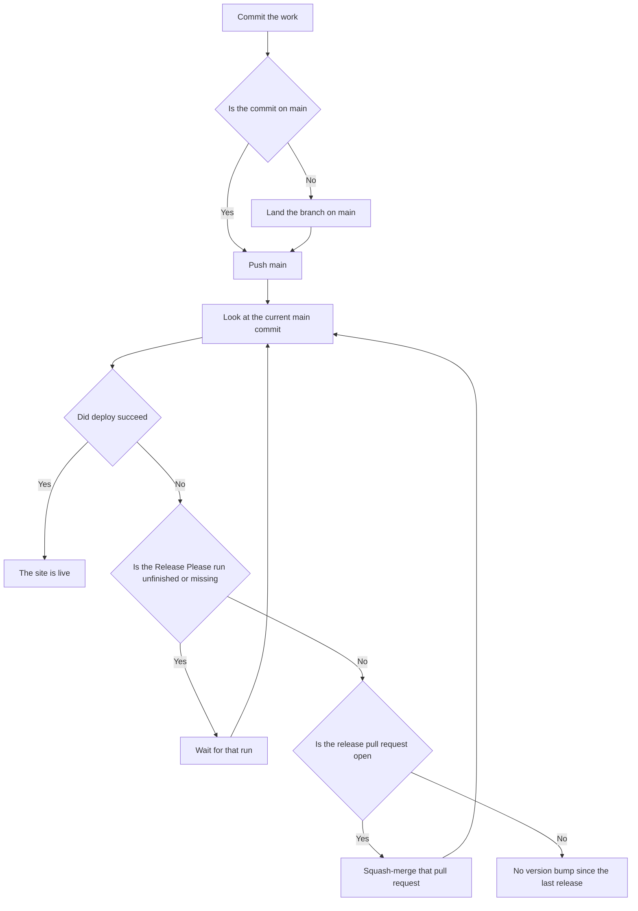

# Shipit

Ship `AeroKita/FoxForge-UNITE` to https://foxforge-unite.com/.

You need permission to push `main` and to merge the release pull request. If you do not, stop.



A later `/shipit` starts at Look once the commits are on `main`. Look before you wait. Wait only when the run or the pull request you need is not there yet.

## Look

Use the current `main` SHA on `AeroKita/FoxForge-UNITE`.

```bash
gh run list --repo AeroKita/FoxForge-UNITE --workflow "Release Please" --commit <sha> --json databaseId,status,conclusion,url,headSha
```

Read the jobs for a finished run:

```bash
gh run view <databaseId> --repo AeroKita/FoxForge-UNITE --json jobs
```

- Job `deploy / deploy` succeeded: the site is live. Stop.
- The run is `queued` or `in_progress`, or it is not listed: wait.
- The run finished and job `deploy` was skipped: look for the release pull request. Do not wait.

```bash
gh pr list --repo AeroKita/FoxForge-UNITE --state open --json number,title,headRefName,headRefOid,url
```

The release pull request is the open one whose head ref starts with `release-please--branches--main`. The branch for this repository is `release-please--branches--main--components--unite-build-optimizer`. Its author is `github-actions[bot]`.

- That pull request is open: squash-merge it.
- The run finished, job `deploy` was skipped, and that pull request is not open: there is no version bump since the last release. Stop. Do not invent a commit to force a bump.

A version bump is a `feat`, a `fix`, or a breaking change.

## Wait

Wait for one run. Do not wait when Look already found a finished run or an open release pull request.

If the run is not listed, the push has not registered yet. List it again. If it is still missing, list it one more time. If it is still missing, stop and give the SHA. The next `/shipit` looks again.

If the run is `queued` or `in_progress`, watch it:

```bash
gh run watch <databaseId> --repo AeroKita/FoxForge-UNITE --exit-status
```

Then Look again. A failed or cancelled run can be re-run once with `gh run rerun`. Then watch the new attempt and Look again.

## Squash-merge

Merge the release pull request. Leave its title as the commit subject.

```bash
gh pr merge <number> --repo AeroKita/FoxForge-UNITE --squash --match-head-commit <headRefOid>
```

Do not pass `--subject`, `--body`, `--merge`, or `--rebase`.

If the head SHA moved, Look again. Do not wait when the new head is already on the open pull request.

Fast-forward local `main` after the merge. The merge is a new commit. Look at that commit. Its Release Please run is a different run from the one that opened the pull request. Job `deploy` on the first run does not publish the site.

## Land on main

If the work is on another branch, put those commits on `main` before Look. Keep the history linear. Squash-merge the pull request, or push to `main` when that is how this work lands.

## When deploy fails

Read the failed step on the run you watched. A failed test needs a new commit on `main`. A failed Pages publish can be re-run. Then Look again.
